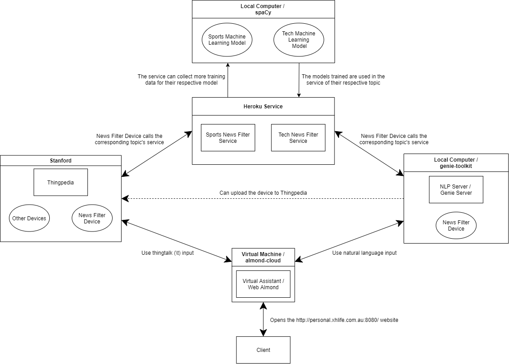

# Personal Virtual Assistant for News Filtering
This project aims to use machine learning and natural language processing to create a personal assistant that can filter news based on the user's personal preference.

## Client's Vision
The ISS (Institutional Shareholder Services) filters through 500k news articles daily to find controversial activities of public companies in the areas of environment, human/labour rights, and corruption. They then provide that information to their clients, large institutional investors around the globe. Currently, the ISS employs analysts equipped with different search and ML (Machine Learning) / NLP (Natural Language Processing) technologies to pre-filter news articles daily. In the future, the ISS would like to provide a text-based personal virtual assistant to their analysts and clients to help them more easily find articles of interest while navigating the news. The assistant would be able to learn about the preferences of each individual user by observing interaction patterns and asking clarifying questions.

Last semester, the team managed to deploy a working implementation of [Almond](https://almond.stanford.edu/), an open source text based virtual assistant. The team also managed to create a news filter service that filters articles based on one of two topics, sports or technology, and implemented the ability for Almond to communicate with the service. The two parts still had some room for improvement, as the news filter showed articles that are irrelevant to the selected topic and Almond itself could only accept programming language as the user input. The client also found the UI (User Interface) design of Almond to be old fashioned and not interesting. As such, the client envisioned that the team would be able to improve the news filter, implement an NLP component to Almond, and implement a redesign of the Almond UI.

## Client
Our client is Marcel Neuhausler, from the
[ISS (Institutional Shareholder Services)](https://www.issgovernance.com/). Marcel is also joined by two other ISS employees, Chelsea Nicole Ramos and Derrick Liu.

## Client Expectations
- A working implementation of the NLP component of the virtual assistant, allowing the user to use human language to communicate with the assistant.
- A news filter service with improved accuracy that finds more relevant/related articles for the requested topic.
- An implementation of a redesign of the UI of the virtual assistant, with focus on a more modern and interesting look.

## Project Impact
This project will improve upon the previous semester’s implementation of the open source virtual assistant [Almond](https://almond.stanford.edu/) by adding the ability to understand natural language, improving the accuracy of the news filter, and redesigning the entire UI to be more modern. The client can then judge if the final result is suitable to be used as the base for implementing their own personal assistant that can be used for lowering the workload of the ISS analysts as well as a possible revenue stream if provided directly to their clients as a service.

## Milestones, Scheduling, Deliverables
### Milestones
1. Setup a new landing page for the project with links to the repository, project documents, and planning board.
2. Reimplement the device created for news filtering to be compatible with the newest local version of Almond.
3. Redeploy the web version of Almond using the newest version.
4. Implement the NLP component of the news filter device.
5. Implement the new web UI design directly in the web version of Almond.
6. Analyze the cause of the performance of the news filter service.
7. Improve the accuracy of the news filter service.

### Scheduling
We will hold four sprints (one every two weeks) in the following schedule:
1. Sprint 1: Week 2 to Week 4, focused on deciding the project tools, implementing the local version of Almond, reimplementing the news filter device, finalizing the new UI design, start implementing the website, and start exploring ways to improve the accuracy of the news filter.
2. Sprint 2: Week 5 to Week 6, focused on implementing the NLP component of the news filter device, continuing the implementation of the website, and continuing  to explore ways to improve the accuracy of the news filter.
3. Sprint 3: Teaching Break to Week 8, focused on finishing documentation, continuing the implementation of the website, and finalizing the news filter.
4. Sprint 4: Week 9 to Week 10, focused on finishing documentation, finishing the implementation of the website, and testing the final version of Almond.

### Deliverables
**Delivery Date: Week 12 (25/10/2021 - 31/10/2021)**
| No. | Deliverable | Items | Handover |
|-----|-------------|-------|----------|
|  1. | Standalone deployment of Web Almond that uses a new UI design and has a working NLP component | Github repositories:   - Landing page: https://github.com/TechLauncher-its-personal/Personal-Virtual-Assistant-for-News-Filtering   - Local Almond: https://github.com/TechLauncher-its-personal/genie-toolkit   - Web Almond: https://github.com/TechLauncher-its-personal/almond-cloud   - Sports News Filter Service: https://github.com/TechLauncher-its-personal/sports-topic-service   - Tech News Filter Service: https://github.com/TechLauncher-its-personal/tech-topic-service   - Sports News Filter Model: https://github.com/TechLauncher-its-personal/sports-topic-model   - Tech News Filter Model: https://github.com/TechLauncher-its-personal/tech-topic-model | Forking the repositories using the ISS github account.|
||| Documentation on the requirements of each part of the project, how to install them, and how to run them. | Main documentation file included in the landing page, but each repository will have their own documentation file as well. |
|  2. | Collection of training data for the news filter service (combined with the previous semester’s collection) | Training data for the news filter device NLP (genie-toolkit), generated through a set of commands and configuration files, and the news filter service NLP (spaCy), collected through a kaggle dataset and processed manually by the team. The news filter service training data is divided into 4 different files: sports_topic_eval: 800 relevant articles and 1600 irrelevant articles. sports_topic_training: 3200 relevant articles and 3200 irrelevant articles. tech_topic_eval: 800 relevant articles and 1600 irrelevant articles. tech_topic_training:  3200 relevant articles and 3200 irrelevant articles. | The news filter device training data is located in the genie-toolkit repository while the news filter service training data is located in both the sports-topic-model and the tech-topic-model repositories. |

## Constraints
1. Our team works remotely. It is almost impossible for us to hold offline meetings or events.
2. The client and the Almond team are both based in America, so their timezone is very different compared to the team members' own time zones (Indonesia, China, Australia). As a result, effective communication time is very limited.

## Risks
1. If we decide to collect more for this semester, finding additional data collection of articles may take more time than anticipated based on last semester’s difficulty in gathering data.
2. Our team is more likely to be inefficient compared to traditional teams since we are entirely remote/online.
3. It is not known how much of the previous semester’s code for Almond can be reused since we will use a newer version of Almond.
4. The team has limited experience in NLP and web development and as such may require more time than anticipated or have some difficulties when implementing either part.
5. The accuracy of the news filter may be difficult to improve past a certain point.
6. Implementing the NLP component of the news filter device in Almond relies heavily on the existing documentation because it uses a custom language.

## Website Deployment
[The website containing a deployment of our project can be found here](http://personal.xhlife.com.au/)

## Website Usage Details (Assistant is available on 9.00 - 12.00 AEDT)
**IMPORTANT: Perform a hard refresh when accessing the site to update the asset files**

(optional) Login with the credentials:
- Username: anonymous
- Password: rootroot

To access the assistant chatbox, either click the "Try Genie Now" button or go to My Genie after logging in.

Example commands:

Available topics: sports, tech
- Get a news article for a certain topic:
    - "Give me sports news articles"
    - "Show me tech news articles"

- Add new training data for the news filter for a certain topic (**must be logged in**):
    - "I want to train the sports topic"
    - "Start training for the tech topic"

## Project Diagram

## Resources (Open Source)
- [Stanford Open Virtual Assistant Platform](https://oval.cs.stanford.edu/)
- [Stanford's Almond](https://almond.stanford.edu/)
- [Stanford's Almond Documentation](https://wiki.almond.stanford.edu/)
- [Stanford's Almond-cloud Repository](https://github.com/stanford-oval/almond-cloud)
- [Stanford's Local Almond (genie-toolkit) Repository](https://github.com/stanford-oval/genie-toolkit)
- [Stanford's Almond Community Forum](https://community.almond.stanford.edu/)

## Other Resources, Services and Repositories (Our Work)
- [Elevator Pitch](https://docs.google.com/document/d/1ZaMdk6tZfe3QobNOUyrbdboDMjiR_0Rm/edit?usp=sharing&ouid=109170627267257036138&rtpof=true&sd=true)
- [Meeting Minutes (Communication Documentation)](https://drive.google.com/drive/folders/1Vj8Ivu9qGvGXRI08Y9rPBaLLDdMWr6gq?usp=sharing)
- [Sprint Outcome and Reflection](https://drive.google.com/drive/folders/1cmykd87yhTHyUxhZBPK5ujz-Y88KdasX?usp=sharing)
- [Decision Log](https://docs.google.com/spreadsheets/d/1qPS4JSWMezUjgWUI55_U61ADeIDK21n1/edit?usp=sharing&ouid=109170627267257036138&rtpof=true&sd=true)
- [Reflection Log](https://docs.google.com/spreadsheets/d/1WNLbIKixGZ9geZHBl5R-w0JWmGj-6Khq_sHsn0tKzlU/edit?usp=sharing)
- [Risk Assessment Log](https://docs.google.com/spreadsheets/d/1STsYVHnJdJM3WsPmAAZu-thIxLkZWdFj/edit?usp=sharing&ouid=109170627267257036138&rtpof=true&sd=true)
- [Sports News Filter Service](https://itspersonal-sports-newsfilter.herokuapp.com)
- [Technology News Filter Service](https://itspersonal-tech-newsfilter.herokuapp.com)
- [Sports News Filter Service Repository](https://github.com/TechLauncher-its-personal/sports-topic-service)
- [Technology News Filter Service Repository](https://github.com/TechLauncher-its-personal/tech-topic-service)
- [Sports Machine Learning Model Repository](https://github.com/TechLauncher-its-personal/sports-topic-model)
- [Technology Machine Learning Model Repository](https://github.com/TechLauncher-its-personal/tech-topic-model)
- [Local Almond (genie-toolkit) Repository](https://github.com/TechLauncher-its-personal/genie-toolkit)
- [Web Almond Repository](https://github.com/TechLauncher-its-personal/almond-cloud)

## Repository Details
- Almond 2.0 Alpha Web Deployment

    Contains the code used in the first semester to deploy the Almond 2.0 Alpha web version.
- Almond 2.0 Local Version

    Contains the code used in the second semester to implement the Almond 2.0 local version.
- Almond News Filter Device

    Contains the code used to create the news filter device in Almond. 

- Almond 2.0 Web Version

    Contains the code used in the second semester to deploy the Almond 2.0 web version.  

## Tooling
Task | Tool
-----------|-------
Repository | [Github](https://github.com/TechLauncher-its-personal/Personal-Virtual-Assistant-for-News-Filtering)
Communication | Zoom, Slack, Outlook, [Almond Community Forum](https://community.almond.stanford.edu/)
Documentation | [Google Drive](https://drive.google.com/drive/folders/1ZKMCHTSK-XWvk-Dr2QA7UVDye39tRWGh?usp=sharing)
UI/UX Design | Adobe Illustrator, Adobe Photoshop, Balsamiq Wireframe, Figma
Development Environment | Visual Studio Code, NotePad++
Web Framework | Pug
Data Science / ML Environment | Jupyter
ML / NLP Training | SpaCy, Genie
Planning | [Jira](https://itspersonal.atlassian.net/jira/software/projects/IP/boards/1) (Viewer account information available in the landing page Google Sheet)

## Statement of Work (Updated Saturday, 9 October 2021)
The statement of work is located in the Statement of Work folder in the Google Drive [here](https://drive.google.com/file/d/1sWIT9vng-49B7W9xppUsKXoUTdRbxLwn/view?usp=sharing).

## Tutorial Time and Tutor
Tutorial Time: Wednesday, 12.00-14.00 AEDT

Tutor: Elena Williams

Examiner: Charles Gretton

## Project Members
Member | Role
-------|-----
Anggrio Wildanhadi Sutopo | Team Leader, Spokesperson
Junjie Zou | ML/NLP Developer, Reflection Log Keeper, Spokesperson
Zhihao Ye | ML/NLP Developer, Decision Log Keeper
Mingjie Shi | Web Developer, Risk Assessment Log Keeper
Yanan Wu | UI/UX Developer, Notekeeper
Pengyue Yang | UI/UX Developer

## Weekly Meeting Schedule
Day | Time (AEDT) | Type
----|------|-------
Monday | 21.00-23.00 AEDT | Team Meeting
Tuesday | 11.00-12.00 AEDT | Client Meeting
Wednesday | 12.00-14.00 AEDT | Tutorial
Thursday | 21.00-23.00 AEDT | Team Meeting
Saturday | 21.00-23.00 AEDT | Team Meeting